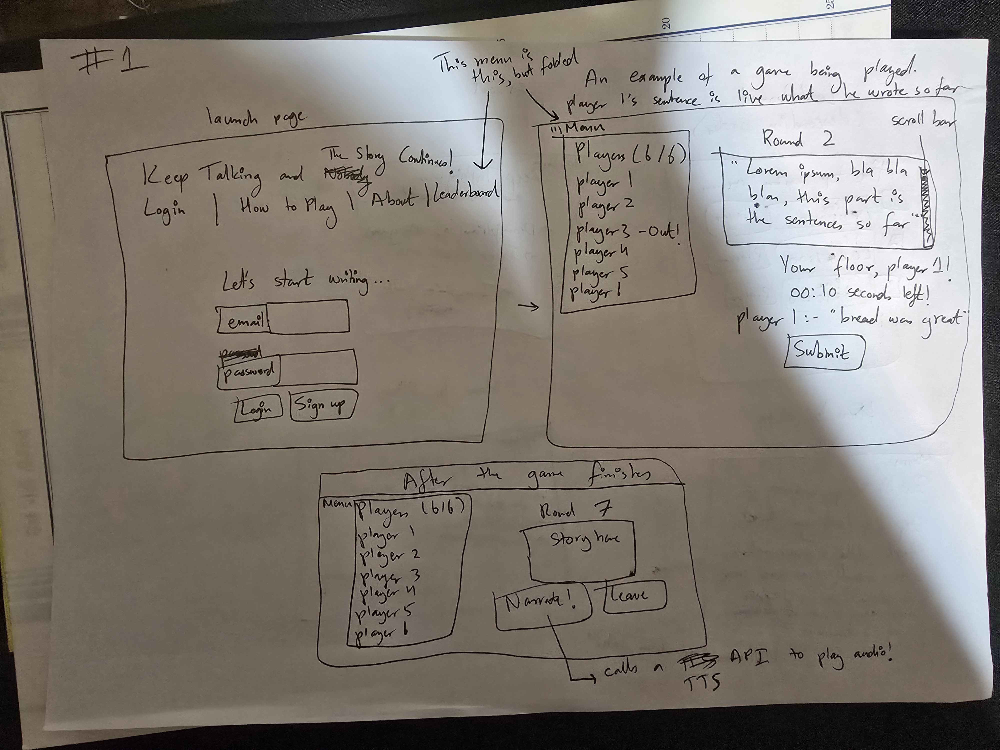
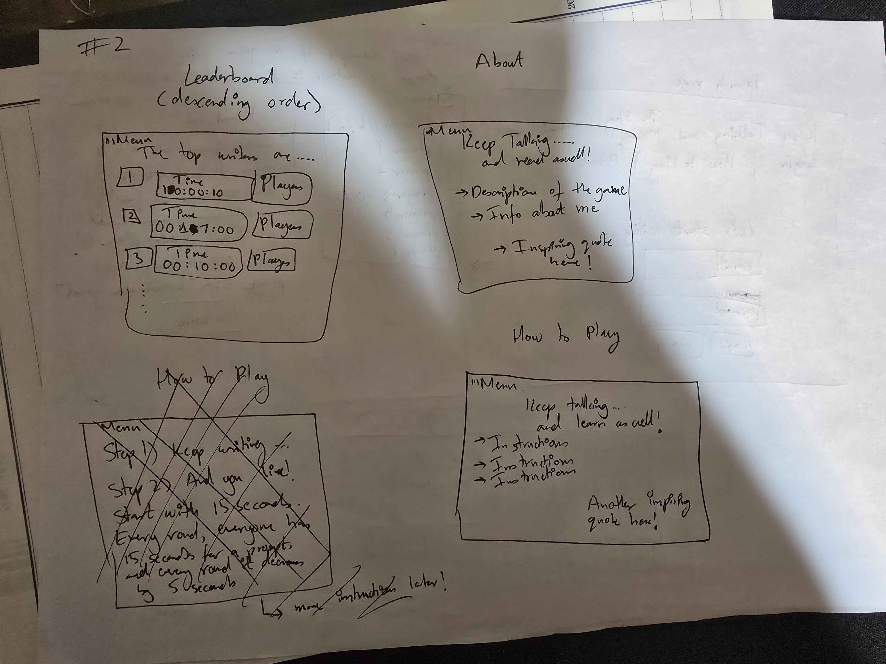

# Keep Typing and the Story Continues!

[My Notes](notes.md)

This web application is an adaptation of the popular elementary game of "Once upon a time..." but with the implementation of a 6-player game room. The application uses a timer to make the game competitive, and the last one standing is the victor.

## 🚀 Specification Deliverable

For this deliverable I did the following. I checked the box `[x]` and added a description for things I completed.

- [X] Proper use of Markdown - Cloned the repository from Simon, understood how it worked, and implemented it
- [X] A concise and compelling elevator pitch - Added some informal humor into the pitch, made it not too long, and used a call to action for the pitch to sound great.
- [X] Description of key features - Extracted the key features of my web application from the images and the pitch, and added them in.
- [X] Description of how you will use each technology - Read up on what the technologies do to the best of my current ability and linked features to technologies.
- [X] One or more rough sketches of your application. Images must be embedded in this file using Markdown image references. - Created a folder for images, and used Markdown image reference to put it inside my startup deliverable.

### Elevator pitch

Have you ever wondered who the most quick-witted person is in your friend group? Maybe you've tested that out in the playground, where each person continues the story you've started out with until it went from Antarctica to Narnia? This Keep Typing and the Story Continues! application lets you join a 6-player game where all players, in turn, attempt to continue the story while a timer ticks down. Once the timer reaches zero? Boom! You're out of the game. Channel your inner James Bond, and become the 007 of the writing world (at least, in your friend group!)

### Design

### Key features

- Secure login over HTTPS.
- The capability to play with 5 other unique players.
- Once the game concludes, an option to press a "Narrate!" button which will play Text-to-Speech for the end user using ElevenLabs.
- Games are persistently stored.
- A leaderboard to show the longest game, and who played in it.
- The prompts written by players displayed in real-time.
- A scrollbar for the story so far

### Technologies

I am going to use the required technologies in the following ways.

- **HTML** - Six HTML pages: Login, How to Play, About, the game being played, the page after the game completes that has a Narrate! button, and the leaderboard. I may cut this down if some pages become redundant, such as folding the How to Play page into the About page.
- **CSS** - The aesthetics of the pages. Right now, I plan to implement a soft blue color persistently in the background using CSS styling. It will have good contrast with the rest of the page aesthetics, and needs to be able to fit both PC and mobile layouts.
- **React** - This is the frontend. Handles logic for Login, submitting an entry, the timer buzzing down, appending onto the string so that the story is updated in real-time
- **Service** - The backend for React. It will handle the actual login and entry submission so that the frontend and the backend both work together.
- **DB/Login** - This will store the player signups and logins, the longest games played as well as who played in them. This website cannot be used without this database authenticating the user's credentials
- **WebSocket** - Updates the current story so far in real-time. Also updates who the current player is during each timer countdown.

## 🚀 AWS deliverable

For this deliverable I did the following. I checked the box `[x]` and added a description for things I completed.

- [X] **Server deployed and accessible with custom domain name** - [My server link](https://keeptalkingandthestorycontinues.click).

## 🚀 HTML deliverable

For this deliverable I did the following. I checked the box `[x]` and added a description for things I completed.

- [X] **HTML pages** - Four HTML pages, starting from index.html that has links to all other pages on all pages.
- [X] **Proper HTML element usage** - I used div elements with ids to differentiate one div from another, as well as spans. These IDs will be useful for CSS styling. Everything also uses other semantic elements, like nav for navigation bar, section for different sections, footer, etc.
- [X] **Links** - Properly used hrefs to link one part of the website to another. The login page will link to the game.html page.
- [X] **Text** - Everything in every page has proper textual context. The "story so far" tab has the actual story that users have inputted so far, to name one. Text boxes have placeholder text to help guide users along, if they have no idea what they need to do. Buttons also have text attached to them that tell you what they do.
- [X] **3rd party API placeholder** - The Narrate! button is the placeholder that will call in a third-party API for Text-to-Speech. It has a proper id to separate itself for this purpose.
- [X] **Images** - Added an image at about.html that suits the page's themes, altered the size, and added an alt for accessibility purposes. It also has its own unique id for CSS styling.
- [X] **Login placeholder** - Added a placeholder login/register with placeholder text. Implemented a "Remember Me" check that uses cookies, but will have to research on how this actually works. For now though, this placeholder will be sufficient.
- [X] **DB data placeholder** - The leaderboard.html will store the data of the top games that were played, ranking which games were played the longest from highest to lowest.
- [X] **WebSocket placeholder** - The real-time implementation of the story so far when users take their turns in game.html represent the WebSocket part of this deliverable. As users type their additions to the story, the story so far section will update in real time.

## 🚀 CSS deliverable

For this deliverable I did the following. I checked the box `[x]` and added a description for things I completed.

- [X] **Visually appealing colors and layout. No overflowing elements.** - I referenced Simon CSS as well as the official Bootstrap documentation for the different class types I could use to make my webpage. A key highlight is the Game page, where I used several cards to create sections of the webpage. I extensively looked at the Bootstrap documentation as well as Stack Overflow whenever I ran into issues. I implemented a custom color that was a bit lighter on the eyes for the Body section, since the bg-warning was too strong on the eyes.
- [X] **Use of a CSS framework** - Extensively used Bootstrap for this assignment. I implemented several cards, as mentioned, as well as using the Navbar from Bootstrap. I also referenced Simon CSS for different areas I could use Bootstrap, and used both it and official documentation to see where I can put it. The Game page extensively uses cards. My Image also uses CSS frameworks. I also used several Bootstrap keywords, like text-dark and bg-dark to apply colors to inlines and blocks.
- [X] **All visual elements styled using CSS** - Explained in the above, but almost everything from HTML was overhauled using CSS. The entirety of my startup now looks presentable, with different colors and custom sections that are only easily done through CSS.
- [X] **Responsive to window resizing using flexbox and/or grid display** - I extensively used Flexbox in every single page to hide the nav and the footer when the page became too small. All body elements also automatically resize, including pictures (I had to actually really look into why my image was constantly zooming in and out when I was resizing it.) This easily was the most confusing to me, and I believe it was accomplished.
- [X] **Use of a imported font** - I imported Roboto and Google Sans from Google Fonts. Roboto was used for Header and Footer, Google Fonts was used for Body.
- [X] **Use of different types of selectors including element, class, ID, and pseudo selectors** - I used all selectors: element, class, ID, pseudo selectors. An example of an element I used was the body element. An example of class was .navbar-brand. An example of ID was #picture img. An example of a pseudo selector was :hover. All of these selectors was used in my assignment to the full.

## 🚀 React part 1: Routing deliverable

For this deliverable I did the following. I checked the box `[x]` and added a description for things I completed.

- [X] **Bundled using Vite** - My code has successfully transitioned from HTML to being bundled by Vite, which has provided me modularity and a more proper hierarchy than the absolute mess of files I had before. Before this deliverable, all of my files were just haphazardly thrown together.
- [X] **Components** - All components (login, leaderboard, game, about) are accounted for, bundled using Vite and routed with ReactRouter. Everything is as it appears before, except now everything is being handled by the router. The header and footer are constants, while only the main body actually changes as you navigate tabs.
- [X] **Router** - All components use ReactRouter to navigate instead of the html format I was previously using. This router is quite amazing, and I actually am quite excited to use this in the future as well.

## 🚀 React part 2: Reactivity deliverable

For this deliverable I did the following. I checked the box `[x]` and added a description for things I completed.

- [X] **All functionality implemented or mocked out** - All functionality has been implemented, with proper turn rotations, round turns, and game over state. LocalStorage ensures that games are saved to the leaderboard. The login screen also properly handles login and register, and the "Remember Username" checkbar properly persists. The third-party API call is to my Narrate button, which has everything mocked out except calling the actual API.
- [X] **Hooks** - Multiple hooks were used, such as UseState for managing the game's state, such as rounds, players, leaderboard entries. UseEffect was used for the timer countdown, game over detection, syncing LocalStorage to leaderboard, and loading that data when needed. I also used useMemo in order to calculate the turn order, and useRef was also used to ensure that the scroll bar properly works.

## 🚀 Service deliverable

For this deliverable I did the following. I checked the box `[x]` and added a description for things I completed.

- [X] **Node.js/Express HTTP service** - Inside service/index.js is my backend server created using Node.js and Express. It handles listening for server ports, parses JSONs, handles cookies, and also services API routes.
- [X] **Static middleware for frontend** - I used express.static('public') in order to serve all of my frontend files, while returning my index.html in case the user somehow ends up on non-API routes.
- [X] **Calls to third party endpoints** - My backend calls ElevenLabs' text-to-speech API inside of service/index.js, specifically the /api/tts endpoint which I got the framework of the code from through ElevenLabs. It generates audio using the unique API key and voice ID that I have stored in ecosystem.config.js by secure shelling into my website, because .env is automatically deleted every time I run the deploy script. Therefore, I used this practice since it was standard practice. The audio that is returned, is heard by the user upon pressing "Narrate!"
- [X] **Backend service endpoints** - Multiple endpoint services are implemented, such as /api/auth/create and /api/auth/login for authentication, and /api/scores for handling scores. I also have a dummy /api/test in order to check if this backend service endpoint works (which it does!)
- [X] **Frontend calls service endpoints** - My frontend calls /api/tts, which calls a backend endpoint. Other frontend files also call the authentication and application feature service endpoints. login.jsx calls POST auth/login and auth/create, which is handled by service/index.js through its apirouter. Passwords, for example, are properly hashed through bcrypt in my async function createUser, and that hashed password is checked through a compare function whenever the user tries to login again. App.jsx also loads score and scores every time a game ends, and scores are loaded into the leaderboard page through backend calls as well.
- [X] **Supports registration, login, logout, and restricted endpoint** - Registration, login, and logout routes were implemented. I also protected these endpoints through the verifyAuth middleware, therefore only allowing authenticated users to access restricted routes like /api/scores. BCrypt was also used to hash passwords, using bcrypt.hash() to hash passwords, and bcrypt.compare() when the user is attempting to log in.

## 🚀 DB deliverable

For this deliverable I did the following. I checked the box `[x]` and added a description for things I completed.

- [X] **Stores data in MongoDB** - The relevant data stored in MongoDB are the scores. Instead of locally updating the score leaderboards when a game concludes, MongoDB automatically sends and retrieves scores into the cluster I have so that this information persists globally. I can verify that data is being stored in MongoDB because inside of my cluster, the "startup" tab contains "score", storing players in an array, the date as a string, and the score (rounds) as an integer.
- [X] **Stores credentials in MongoDB** - Registration, login, and logout are all handled through MongoDB. I changed the apiRouters in my backend to reference MongoDB instead, allowing for information to be stored globally instead of locally. I can verify that credentials are properly stored because inside of my cluster, the "user" tab contains information of every single user that has ever registered. Names are stored in string, while passwords are properly hashed and stored in their hashed format to verify that I cannot view the passwords even if I tried. When a user registers, it is put into my cluster. When a user logs in, the website asks mongoDB for the relevant information to authenticate them.

## 🚀 WebSocket deliverable

For this deliverable I did the following. I checked the box `[x]` and added a description for things I completed.

- [ ] **Backend listens for WebSocket connection** - I did not complete this part of the deliverable.
- [ ] **Frontend makes WebSocket connection** - I did not complete this part of the deliverable.
- [ ] **Data sent over WebSocket connection** - I did not complete this part of the deliverable.
- [ ] **WebSocket data displayed** - I did not complete this part of the deliverable.
- [ ] **Application is fully functional** - I did not complete this part of the deliverable.
